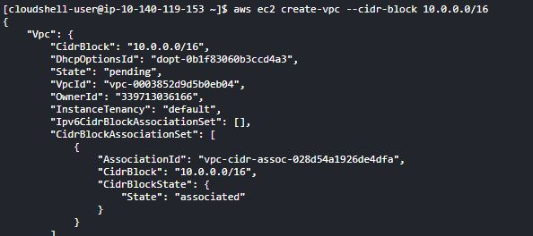
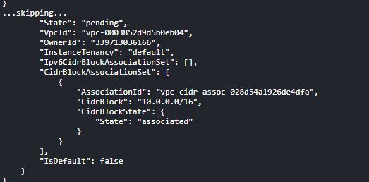
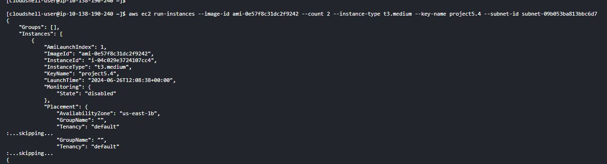
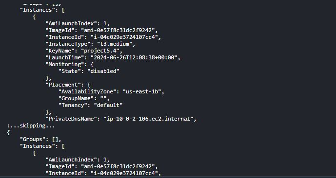
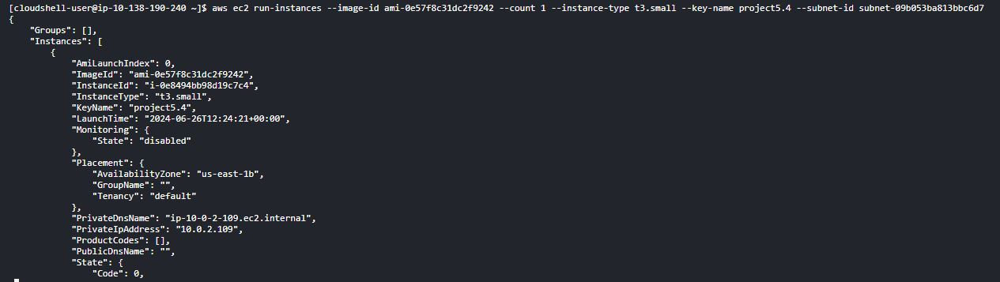
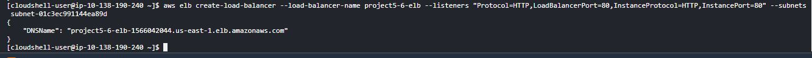

# **Project 5.6: AWS Critical Thinking Project**

## Architectural Design

1. VPC Configuration:

- VPC: Create a Virtual Private Cloud (VPC) with a CIDR block of 10.0.0.0/16.
- Subnets: Create public and private subnets across two availability zones for high availability.

2.  EC2 Instances for Web Servers:

- Web Server Instances: Deploy EC2 instances in the private subnets to host the two websites.
- Instance Types: Choose instance types based on the expected load (e.g., t3.medium for moderate traffic).

3. Reverse Proxy Server (NGINX):

- Reverse Proxy Instance: Deploy an EC2 instance in the public subnet to act as the NGINX reverse proxy.
- Configuration: Configure NGINX to route traffic to the appropriate backend web servers based on the requested domain.

4. Security Groups:

- Reverse Proxy Security Group: Allow inbound HTTP/HTTPS traffic from the internet and outbound traffic to the web servers.
- Web Server Security Group: Allow inbound traffic only from the reverse proxy instance.

5. RDS for Databases:

- RDS Instances: Deploy RDS instances in private subnets for database services, ensuring separation of database and application layers.

6. Auto Scaling and Load Balancing:

- Auto Scaling Groups: Create auto-scaling groups for the web server instances to handle traffic spikes.
- Load Balancers: Use Elastic Load Balancers (ELBs) in front of the web servers if needed for additional load distribution.

7. Route 53 for DNS:

- Domain Configuration: Use Route 53 to manage DNS records for the two websites, pointing to the NGINX reverse proxy.

8. IAM and Roles:

- Roles and Policies: Use IAM roles and policies to manage permissions securely.

# Implementation Steps:

- Step 1: Set Up the VPC
  
  
- Step 2: Launch EC2 Instances for Web Servers
  
  
- Step 3: Launch EC2 Instance for NGINX Reverse Proxy
  
- Step 4: Configure NGINX as Reverse Proxy
- Step 5: Set Up Auto Scaling and Load Balancing
  1. Create Auto Scaling Groups:
     
  2. Attach Load Balancers:
     
